```python
%matplotlib inline
import pandas as pd
import numpy as np
import matplotlib.pyplot as plt
import datetime
from dateutil.relativedelta import relativedelta
import seaborn as sns
import statsmodels.api as sm  
from statsmodels.tsa.stattools import acf  
from statsmodels.tsa.stattools import pacf
from math import sqrt

from statsmodels.tsa.seasonal import seasonal_decompose
import os
from sklearn.metrics import mean_squared_error
from sklearn.utils.validation import check_array

```


```python
path =  "C:/Users/Sagar Ghiya/Downloads"
os.chdir(path)
os.getcwd()
```


    'C:\\Users\\Sagar Ghiya\\Downloads'


```python
name = 'AirPassengers.csv'
dateparse = lambda dates: pd.datetime.strptime(dates, '%Y-%m')
df = pd.read_csv(name, parse_dates=True, index_col='Month',date_parser=dateparse)
```


```python
df.head()
```


<div>
<table border="1" class="dataframe">
  <thead>
    <tr style="text-align: right;">
      <th></th>
      <th>#Passengers</th>
    </tr>
    <tr>
      <th>Month</th>
      <th></th>
    </tr>
  </thead>
  <tbody>
    <tr>
      <th>1949-01-01</th>
      <td>112</td>
    </tr>
    <tr>
      <th>1949-02-01</th>
      <td>118</td>
    </tr>
    <tr>
      <th>1949-03-01</th>
      <td>132</td>
    </tr>
    <tr>
      <th>1949-04-01</th>
      <td>129</td>
    </tr>
    <tr>
      <th>1949-05-01</th>
      <td>121</td>
    </tr>
  </tbody>
</table>
</div>


```python
df.columns = ['Passengers']
df.head()
```


<div>
<table border="1" class="dataframe">
  <thead>
    <tr style="text-align: right;">
      <th></th>
      <th>Passengers</th>
    </tr>
    <tr>
      <th>Month</th>
      <th></th>
    </tr>
  </thead>
  <tbody>
    <tr>
      <th>1949-01-01</th>
      <td>112</td>
    </tr>
    <tr>
      <th>1949-02-01</th>
      <td>118</td>
    </tr>
    <tr>
      <th>1949-03-01</th>
      <td>132</td>
    </tr>
    <tr>
      <th>1949-04-01</th>
      <td>129</td>
    </tr>
    <tr>
      <th>1949-05-01</th>
      <td>121</td>
    </tr>
  </tbody>
</table>
</div>


```python
ts = df['Passengers']
plt.plot(ts)
plt.title("Monthly Passengers")
```


    <matplotlib.text.Text at 0xcdad780>


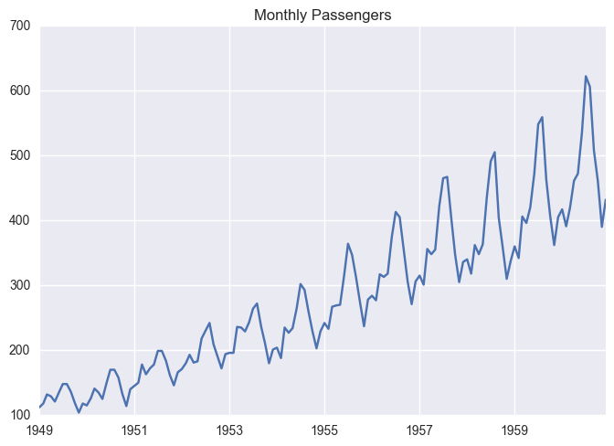


```python
from statsmodels.tsa.stattools import adfuller
def test_stationarity(timeseries):
    
    #Determing rolling statistics
    rolmean = pd.rolling_mean(timeseries, window=12)
    rolstd = pd.rolling_std(timeseries, window=12)

    #Plot rolling statistics:
    fig = plt.figure(figsize=(12, 8))
    orig = plt.plot(timeseries, color='blue',label='Original')
    mean = plt.plot(rolmean, color='red', label='Rolling Mean')
    std = plt.plot(rolstd, color='black', label = 'Rolling Std')
    plt.legend(loc='best')
    plt.title('Rolling Mean & Standard Deviation')
    plt.show()
    
    #Perform Dickey-Fuller test:
    print 'Results of Dickey-Fuller Test:'
    dftest = adfuller(timeseries, autolag='AIC')
    dfoutput = pd.Series(dftest[0:4], index=['Test Statistic','p-value','#Lags Used','Number of Observations Used'])
    for key,value in dftest[4].items():
        dfoutput['Critical Value (%s)'%key] = value
    print dfoutput
```


```python
test_stationarity(ts)
```

    C:\Users\Sagar Ghiya\Anaconda2\lib\site-packages\ipykernel\__main__.py:5: FutureWarning: pd.rolling_mean is deprecated for Series and will be removed in a future version, replace with 
    	Series.rolling(window=12,center=False).mean()
    C:\Users\Sagar Ghiya\Anaconda2\lib\site-packages\ipykernel\__main__.py:6: FutureWarning: pd.rolling_std is deprecated for Series and will be removed in a future version, replace with 
    	Series.rolling(window=12,center=False).std()
    


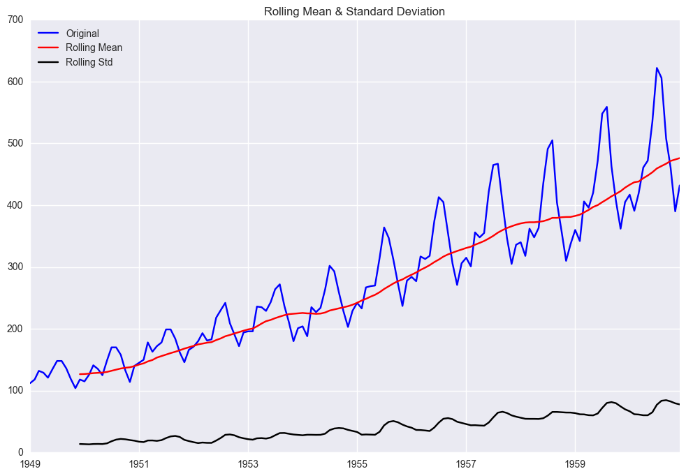


    Results of Dickey-Fuller Test:
    Test Statistic                   0.815369
    p-value                          0.991880
    #Lags Used                      13.000000
    Number of Observations Used    130.000000
    Critical Value (5%)             -2.884042
    Critical Value (1%)             -3.481682
    Critical Value (10%)            -2.578770
    dtype: float64
    


```python
df['first_difference'] = ts - ts.shift(1)
test_stationarity(df.first_difference.dropna(inplace = False))
```

    C:\Users\Sagar Ghiya\Anaconda2\lib\site-packages\ipykernel\__main__.py:5: FutureWarning: pd.rolling_mean is deprecated for Series and will be removed in a future version, replace with 
    	Series.rolling(window=12,center=False).mean()
    C:\Users\Sagar Ghiya\Anaconda2\lib\site-packages\ipykernel\__main__.py:6: FutureWarning: pd.rolling_std is deprecated for Series and will be removed in a future version, replace with 
    	Series.rolling(window=12,center=False).std()
    


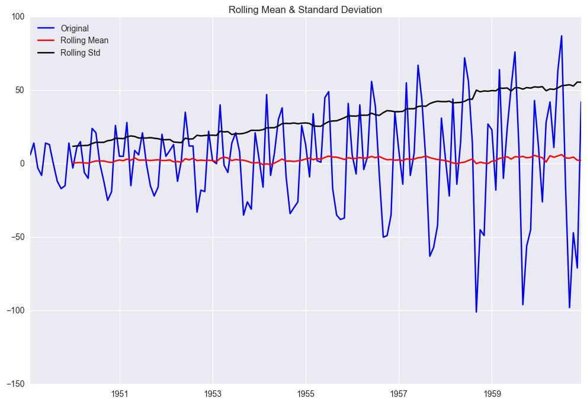


    Results of Dickey-Fuller Test:
    Test Statistic                  -2.829267
    p-value                          0.054213
    #Lags Used                      12.000000
    Number of Observations Used    130.000000
    Critical Value (5%)             -2.884042
    Critical Value (1%)             -3.481682
    Critical Value (10%)            -2.578770
    dtype: float64
    


```python
df['second_difference'] = df.first_difference - df.first_difference.shift(1)
test_stationarity(df.second_difference.dropna(inplace = False))
```

    C:\Users\Sagar Ghiya\Anaconda2\lib\site-packages\ipykernel\__main__.py:5: FutureWarning: pd.rolling_mean is deprecated for Series and will be removed in a future version, replace with 
    	Series.rolling(window=12,center=False).mean()
    C:\Users\Sagar Ghiya\Anaconda2\lib\site-packages\ipykernel\__main__.py:6: FutureWarning: pd.rolling_std is deprecated for Series and will be removed in a future version, replace with 
    	Series.rolling(window=12,center=False).std()
    


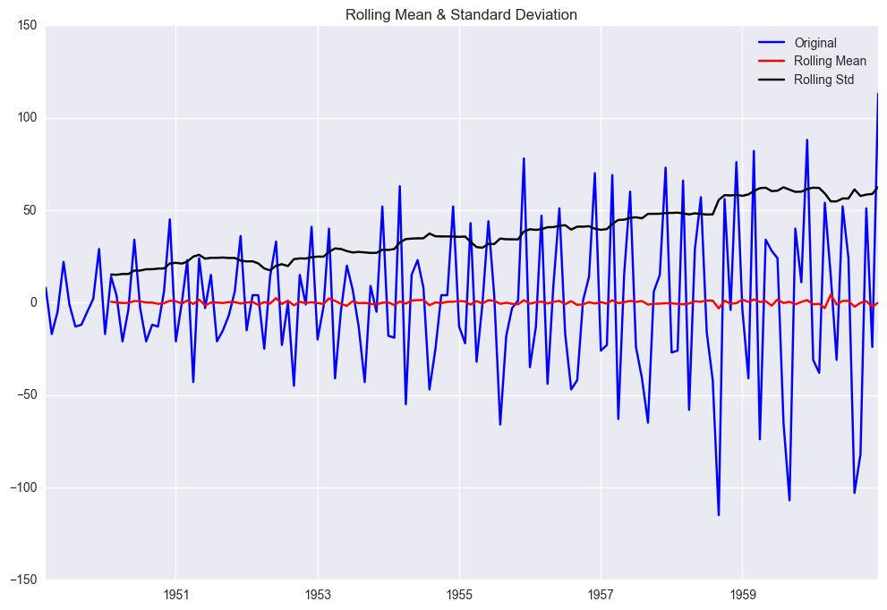


    Results of Dickey-Fuller Test:
    Test Statistic                -1.638423e+01
    p-value                        2.732892e-29
    #Lags Used                     1.100000e+01
    Number of Observations Used    1.300000e+02
    Critical Value (5%)           -2.884042e+00
    Critical Value (1%)           -3.481682e+00
    Critical Value (10%)          -2.578770e+00
    dtype: float64
    


```python
ts_log = np.log(ts)
plt.plot(ts_log)
plt.title("Time Series after log transformation")
```


    <matplotlib.text.Text at 0xe83c2b0>


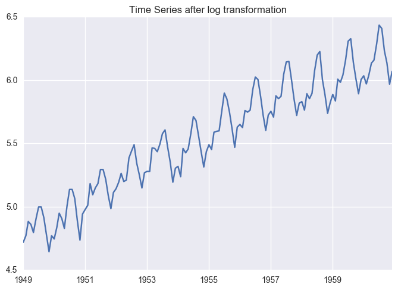


```python
df['log_first_difference'] = ts_log - ts_log.shift() 
```


```python
test_stationarity(df.log_first_difference.dropna(inplace = False))
```

    C:\Users\Sagar Ghiya\Anaconda2\lib\site-packages\ipykernel\__main__.py:5: FutureWarning: pd.rolling_mean is deprecated for Series and will be removed in a future version, replace with 
    	Series.rolling(window=12,center=False).mean()
    C:\Users\Sagar Ghiya\Anaconda2\lib\site-packages\ipykernel\__main__.py:6: FutureWarning: pd.rolling_std is deprecated for Series and will be removed in a future version, replace with 
    	Series.rolling(window=12,center=False).std()
    


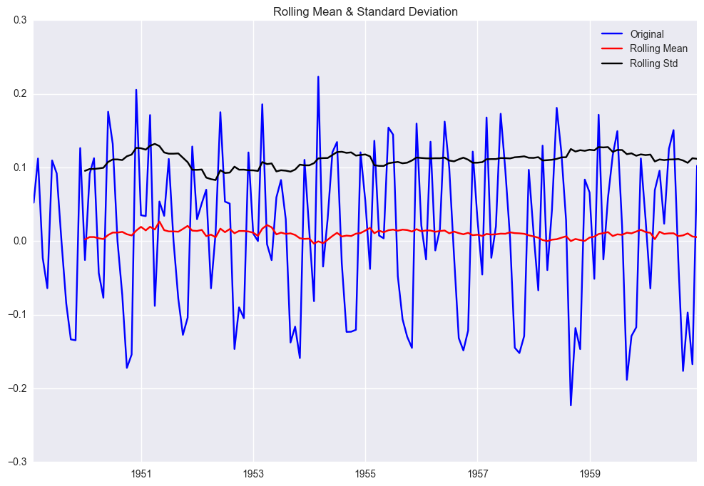


    Results of Dickey-Fuller Test:
    Test Statistic                  -2.717131
    p-value                          0.071121
    #Lags Used                      14.000000
    Number of Observations Used    128.000000
    Critical Value (5%)             -2.884398
    Critical Value (1%)             -3.482501
    Critical Value (10%)            -2.578960
    dtype: float64
    


```python
fig = plt.figure(figsize=(12,8))
ax1 = fig.add_subplot(211)
fig = sm.graphics.tsa.plot_acf(df.first_difference.iloc[2:], lags=20, ax=ax1)
ax2 = fig.add_subplot(212)
fig = sm.graphics.tsa.plot_pacf(df.first_difference.iloc[2:], lags=20, ax=ax2)

```


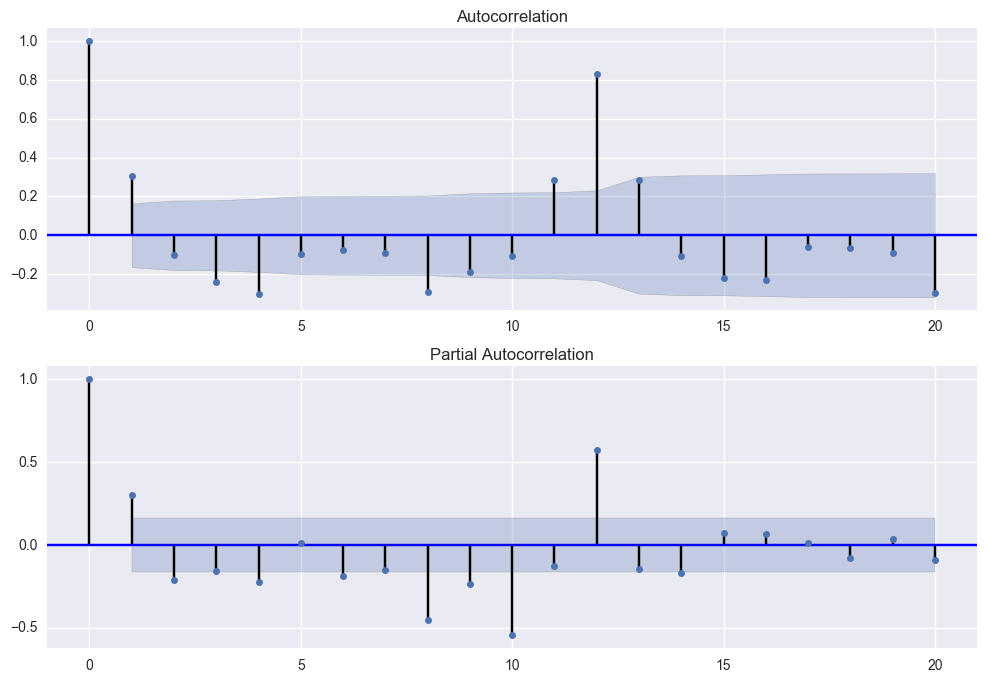


```python
df['seasonal_difference'] = ts - ts.shift(12)
test_stationarity(df.seasonal_difference.dropna(inplace = False))
```

    C:\Users\Sagar Ghiya\Anaconda2\lib\site-packages\ipykernel\__main__.py:5: FutureWarning: pd.rolling_mean is deprecated for Series and will be removed in a future version, replace with 
    	Series.rolling(window=12,center=False).mean()
    C:\Users\Sagar Ghiya\Anaconda2\lib\site-packages\ipykernel\__main__.py:6: FutureWarning: pd.rolling_std is deprecated for Series and will be removed in a future version, replace with 
    	Series.rolling(window=12,center=False).std()
    


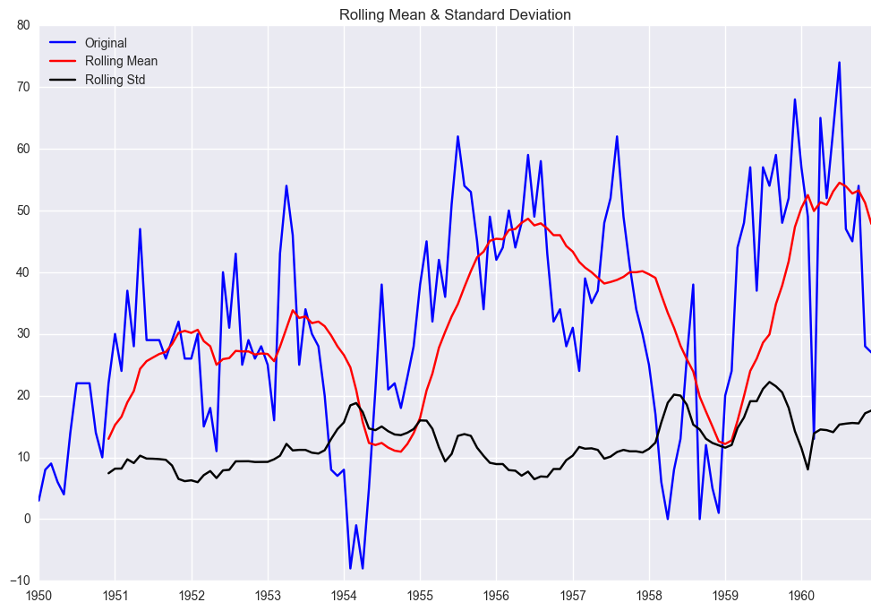


    Results of Dickey-Fuller Test:
    Test Statistic                  -3.383021
    p-value                          0.011551
    #Lags Used                       1.000000
    Number of Observations Used    130.000000
    Critical Value (5%)             -2.884042
    Critical Value (1%)             -3.481682
    Critical Value (10%)            -2.578770
    dtype: float64
    


```python
df['log_seasonal_difference'] = ts_log - ts_log.shift(12)
test_stationarity(df.log_seasonal_difference.dropna(inplace = False))
```

    C:\Users\Sagar Ghiya\Anaconda2\lib\site-packages\ipykernel\__main__.py:5: FutureWarning: pd.rolling_mean is deprecated for Series and will be removed in a future version, replace with 
    	Series.rolling(window=12,center=False).mean()
    C:\Users\Sagar Ghiya\Anaconda2\lib\site-packages\ipykernel\__main__.py:6: FutureWarning: pd.rolling_std is deprecated for Series and will be removed in a future version, replace with 
    	Series.rolling(window=12,center=False).std()
    


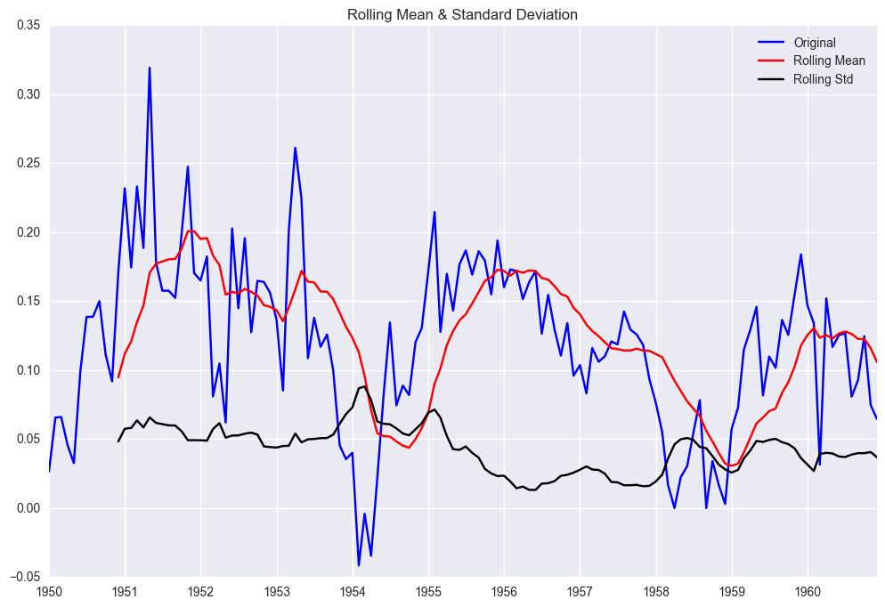


    Results of Dickey-Fuller Test:
    Test Statistic                  -2.709577
    p-value                          0.072396
    #Lags Used                      12.000000
    Number of Observations Used    119.000000
    Critical Value (5%)             -2.886151
    Critical Value (1%)             -3.486535
    Critical Value (10%)            -2.579896
    dtype: float64
    


```python
df['seasonal_first_difference'] = df.first_difference - df.first_difference.shift(12)
```


```python
test_stationarity(df.seasonal_first_difference.dropna(inplace = False))
```

    C:\Users\Sagar Ghiya\Anaconda2\lib\site-packages\ipykernel\__main__.py:5: FutureWarning: pd.rolling_mean is deprecated for Series and will be removed in a future version, replace with 
    	Series.rolling(window=12,center=False).mean()
    C:\Users\Sagar Ghiya\Anaconda2\lib\site-packages\ipykernel\__main__.py:6: FutureWarning: pd.rolling_std is deprecated for Series and will be removed in a future version, replace with 
    	Series.rolling(window=12,center=False).std()
    


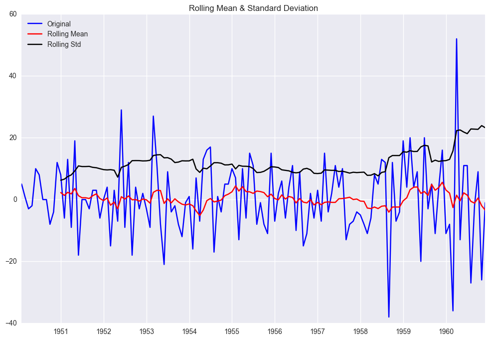


    Results of Dickey-Fuller Test:
    Test Statistic                -1.559562e+01
    p-value                        1.856512e-28
    #Lags Used                     0.000000e+00
    Number of Observations Used    1.300000e+02
    Critical Value (5%)           -2.884042e+00
    Critical Value (1%)           -3.481682e+00
    Critical Value (10%)          -2.578770e+00
    dtype: float64
    


```python
fig = plt.figure(figsize=(12,8))
ax1 = fig.add_subplot(211)
fig = sm.graphics.tsa.plot_acf(df.seasonal_first_difference.iloc[13:], lags=20, ax=ax1)
ax2 = fig.add_subplot(212)
fig = sm.graphics.tsa.plot_pacf(df.seasonal_first_difference.iloc[13:], lags=20, ax=ax2)
```


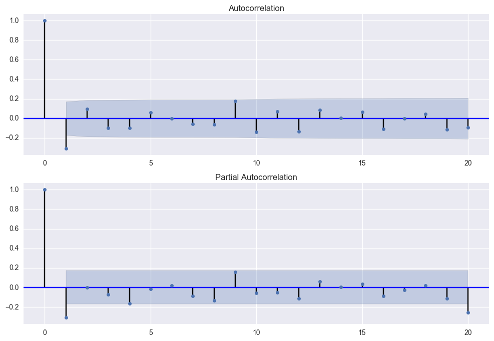


```python
mod = sm.tsa.statespace.SARIMAX(df.Passengers, trend='n', order=(1,1,1), seasonal_order=(0,1,0,12))
results = mod.fit()
print results.summary()
```

                                     Statespace Model Results                                 
    ==========================================================================================
    Dep. Variable:                         Passengers   No. Observations:                  144
    Model:             SARIMAX(1, 1, 1)x(0, 1, 0, 12)   Log Likelihood                -508.197
    Date:                            Mon, 03 Apr 2017   AIC                           1022.393
    Time:                                    13:38:54   BIC                           1031.303
    Sample:                                01-01-1949   HQIC                          1026.014
                                         - 12-01-1960                                         
    Covariance Type:                              opg                                         
    ==============================================================================
                     coef    std err          z      P>|z|      [0.025      0.975]
    ------------------------------------------------------------------------------
    ar.L1         -0.3014      0.355     -0.848      0.396      -0.998       0.395
    ma.L1         -0.0069      0.336     -0.020      0.984      -0.665       0.651
    sigma2       137.0241     14.656      9.349      0.000     108.299     165.749
    ===================================================================================
    Ljung-Box (Q):                       51.72   Jarque-Bera (JB):                 7.70
    Prob(Q):                              0.10   Prob(JB):                         0.02
    Heteroskedasticity (H):               2.33   Skew:                             0.00
    Prob(H) (two-sided):                  0.01   Kurtosis:                         4.19
    ===================================================================================
    
    Warnings:
    [1] Covariance matrix calculated using the outer product of gradients (complex-step).
    


```python
df['forecast'] = results.predict(start = 101, end= 145, dynamic= True)  
df[['Passengers', 'forecast']].plot(figsize=(12, 8))
```


    <matplotlib.axes._subplots.AxesSubplot at 0x13bbf0b8>


```python
a = df.Passengers[101:145]
b = df.forecast[101:145]
sqrt(mean_squared_error(a,b))
```


    25.104494433764778


```python
x = np.array(a)
y = np.array(b)
mape = np.mean(np.abs((a - b) / a)) * 100
mape
```


    4.94238024181486


